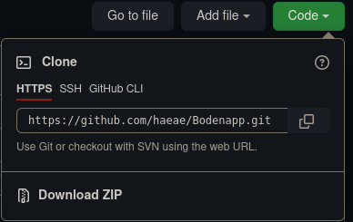
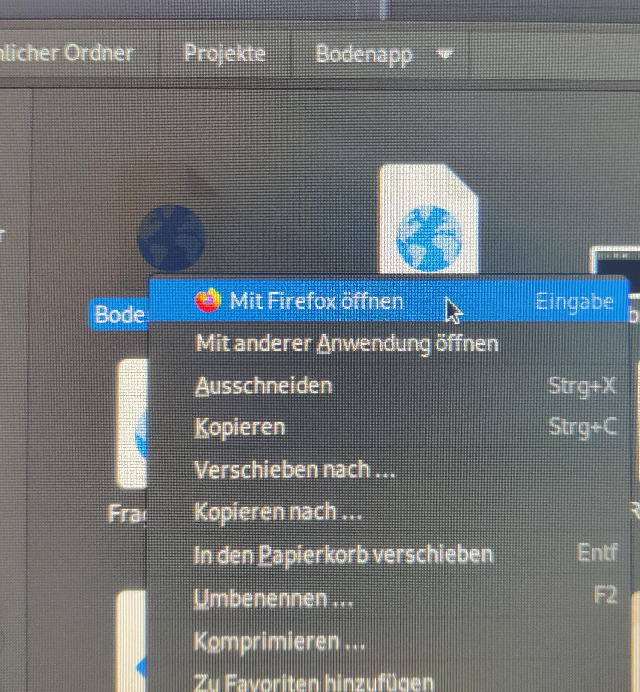

# Bodenapp
The *Bodenapp* helps to guess the amount of humus in the soil by answering some questions


## plans

1. Brennprobe
2. pH-Bestimmung
3. Design
4. PWA

## Usage
### Beginners

1. Download zip and extract it



2. open file broswer by inserting *file:///path/to/file/Bodenapp.html* into adress bar


or open it in file manager:



### Advanced

```bash
git clone https://github.com/haeae/Bodenapp.git
cd Bodenapp/
firefox Bodenapp.html
```
